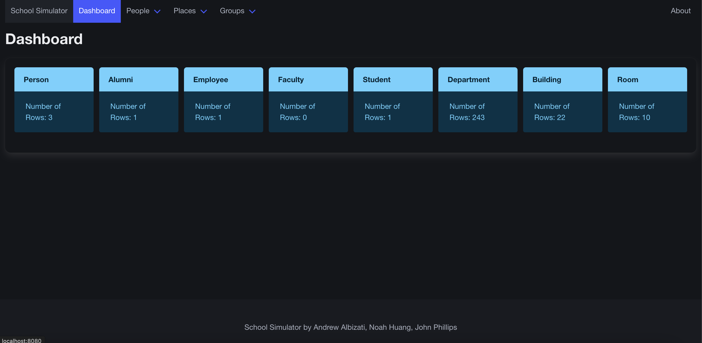
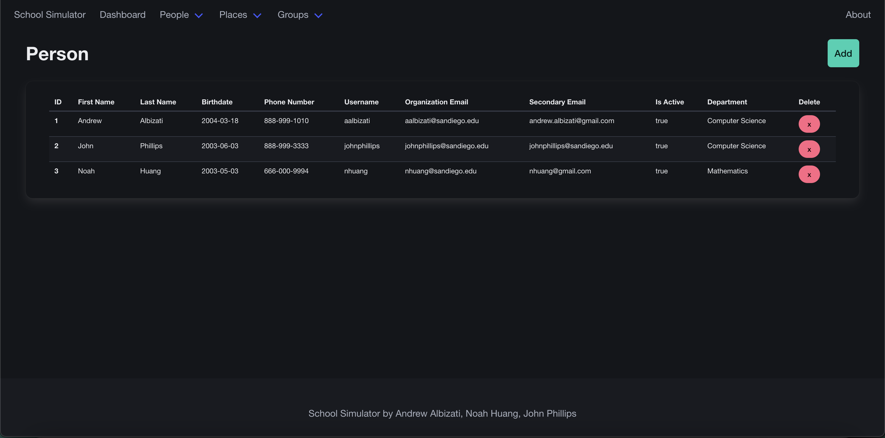
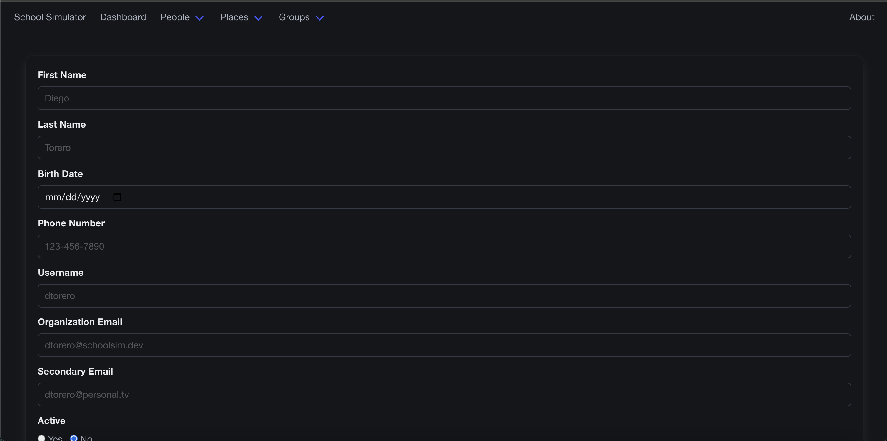

# SchoolSim
SchoolSim is an identity management system designed specifically for universities, with capabilities for adding/deleting/viewing the following user types:

- Alumni
- Employee
- Faculty
- Student

This project is written in Java and uses the [Spring](https://spring.io/) framework.
We decided to use Java because it enforces type safety and object-oriented principles.
We decided to Spring because it is well documented and has a large community.

In addition, this project hosts its data on a [MySQL](https://www.mysql.com/) database.
We decided to use this database because it's very simple to set up for remote connections,
and it makes very efficient queries for large datasets.

This database is run on a [Raspberry Pi 5](https://www.raspberrypi.com/products/raspberry-pi-5/)
running [Debian 12](https://www.debian.org/releases/stable/releasenotes). We choose this configuration to host the server since
it's quick to get up and running, and can be hosted continuously without incurring fees.

## Demonstration
After connecting to the website, the user will be greeted with a statistics dashboard:



From there, the user can see data about how many entries are in each database table. If the user clicks on `People`,
they will be shown:



From here, they can view data for each person that has beena added to the database. On the right side of each entry,
there is an `X` button to delete an entry. In the upper right corner of the webpage, there is an `Add` button to add an entry.

After clicking on this, the user will be shown a form where they can input data about a particular user




## Prerequisites
1. Please ensure that you have `git` by running the following command in a terminal: `git --version` (download [here](https://git-scm.com/downloads)).
2. Please ensure that you have `java 20` by running the following command in a terminal: `java --version` (download [here](https://www.oracle.com/java/technologies/javase/jdk20-archive-downloads.html)).
3. Please ensure that you are connected to the same network as the server. You can test this by running `ping [host address]` in a terminal and see if there's a response.

## Host Server & Database Setup
Firstly, please ensure that you have a Linux server running that can access the Internet.
From there, you can install `MySQL` by running `sudo apt install mysql-server` in the terminal.
Please finish the setup guide found [here](https://www.geeksforgeeks.org/how-to-install-mysql-on-linux/).

Run the following command as a MySQL root user: `CREATE USER 'new_user'@'%' IDENTIFIED BY 'password';`.
By using `%`, you will allow the user to connect remotely via any IP.

Once the user has been created, run the following commands to setup the production database:
1. `CREATE DATABASE ProductionDatabase;`
2. `USE ProductionDatabase;`
3. `SOURCE sql/create-prod-db.sql`

Then create the proper test database:
1. `CREATE DATABASE TestDatabase;`
2. `USE TestDatabase;`
3. `SOURCE sql/create-test-db.sql`

Lastly, run the following commands to grant the user all privileges for those two databases:
- `GRANT ALL PRIVILEGES ON ProductionDatabase.* To 'new_user'@'%' IDENTIFIED BY 'password';`
- `GRANT ALL PRIVILEGES ON TestDatabase.* To 'new_user'@'%' IDENTIFIED BY 'password';`
- `FLUSH PRIVILEGES;`

From there, the host server should be setup successfully. This can be tested in the next section.

## Installation
1. Open a terminal and run `git clone https://github.com/usd-cs/comp305-final-project-sp24-s01s02-jj.git`
2. Open the newly created folder, and navigate to `src/main/resources`. From there, create a file named `config.properties` and enter the following information:
   1. ```properties
      database_name=
      database_username=
      database_password=
      database_host=
      ```
   You'll want to enter the host server values that were created in the previous section.

3. Open the newly created folder, and navigate to `src/test/resources`. From there, create a file named `config.properties` and enter the following information:
   1. ```properties
      database_name=
      database_username=
      database_password=
      database_host=
      ```

   You'll want to enter the same values as before, but change the database name to the test database.

4. Open a terminal in the root folder and run the command:
   1. `./gradlew build` on macOS/Linux
   2. `gradlew build` on Windows

5. If any tests fail during the build process, then please troubleshoot the server creation.
6. Navigate to `build/libs/`, and execute the JAR file that is created.
7. Visit `localhost:8080` to view the website.

## Contact
- aalbizati@sandiego.edu (Host server, model classes)
- johnphillips@sandiego.edu (Controller classes)
- nhuang@sandiego.edu (Service classes)